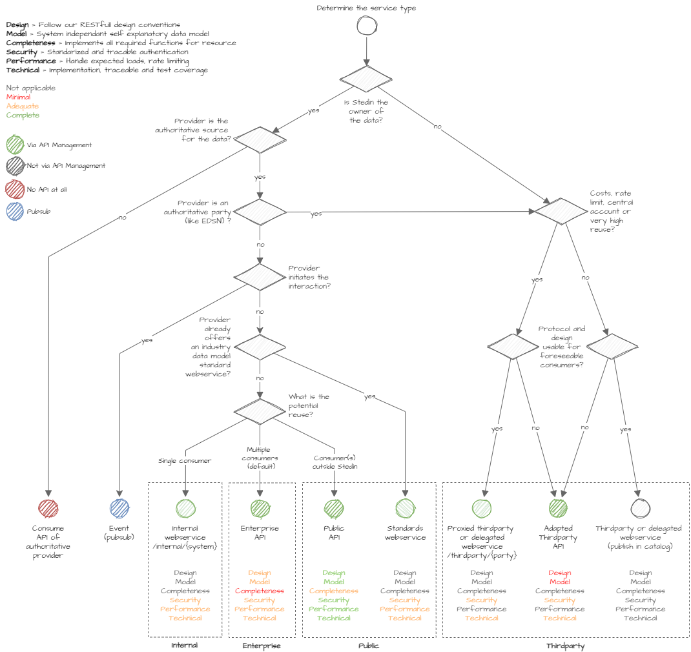

API conventions include naming conventions, error handling, but also conventions for testing, security etc. The conventions are based on the REST (Representational State Transfer) principles.

- Resources expose entities through URIs. They are representations of something, often an object. Example: ‘books’, ‘addresses’, ‘orders’*.
- Messages use HTTP methods explicitly (i.e. GET, POST, PUT, PATCH, and DELETE).
- Stateless interactions store no client context on the server between requests. State dependencies limit and restrict scalability.

For more information on REST: [Fielding, Roy Thomas (2000). Chapter 5: Representational State Transfer (REST)](https://www.ics.uci.edu/~fielding/pubs/dissertation/rest_arch_style.htm).

## Keywords used in these conventions

The requirement level keywords "MUST", "MUST NOT", "REQUIRED", "SHALL", "SHALL NOT", "SHOULD", "SHOULD NOT", "RECOMMENDED", "MAY", and "OPTIONAL" used in this document (case insensitive) are to be interpreted as described in RFC 2119.

## Convention numbering

For improved reference and management all conventions are numbered. The numbers are in square brackets at the end of the convention title. The number has no meaning and no hierarchy. New higher numbers can be added and put next to exiting lower numbered conventions in the wiki structure.

## API Management

Azure API Management is the API manager for all APIs. Four different API management instances are used for respectively development, test, acceptance and production.
When the backend of an API is an SAP product, SAP API Management is the backend of Azure API Management.

## Application programming interface (API)

To put it in context: An API exposes a backend (web)service or system to a consumer. With APIs it is possible to:

- Define what part of a system is exposed and to whom.
- Create an extra layer of security.
- Mashups can combine information from different sources and expose them in a single new endpoint.
- APIs can perform content type transformations.
- API management can provide features like analytics. etc.

## Terminology

Some terms used in this document can have different meaning to different people. For clarification, we will provide definitions for the following terms:

**Service**: a software function that is exposed and accessible over a computer network.

**Web service**: a Service that is exposed via HTTP.

**Backend**: the Information system providing a service.

**API**: In this document APIs are referred to as RESTful APIs that expose a web service. They are consumed via Azure API Management.

**End-user**: An End-users normally doesn’t consume the APIs directly. They consume the API via a client application or website. An example of this is a user who for instance uses a weather app to see the weather forecast. The actual weather data comes from an API that is consumed by the weather app.

**Client**: The Application / browser that is used to access the API. It sends requests to the API (proxy) and receives back responses. The API client serves an end-user.

**API consumer**: Developers or Partners creating mobile apps or websites for the end-users. They consume the APIs by integrating them in their apps and websites. API consumers are the targeted users of the developer portal. In Azure API management they can register their apps and get access to products that consist of APIs.

**API customer**: API customers pay for using commercial APIs and decide which APIs will be used.

**Developer portal**: Used to engage with API customers and API consumers. Often maintained by the API provider(s). This is the place where they can find API documentation, try out APIs and acquire API credentials.

**API provider**: Also, API developer. The API provider exposes data or functionality by creating and operating APIs and making them available to others. Typically, they use an API management platform to do this. The API provider is often part of an API team but can also be an organisation. The provider typically uses a developer portal to provide information / documentation about their APIs to the API consumers.

## Types of APIs

|Term|Explanation|
|---|---|
|Public API or standards webservice|This means that the API was built with the intention that it can be opened up to external parties. Have to meet the highest standards.|
|Enterprise API|APIs that were built to be used by Stedin's own systems and processes. No external use is foreseen.|
|Internal webservice|Meant for one specific consumer when there is no potential reuse. Typically for communication within a single supporting business domain (like HR or finance).|
|Thirdparty webservice|Webservices provided by another party like EDSN, Kadaster, weather. Services provided by SAAS or purchased software doesn't necessarily fall in this category.|

## Service type decision tree

