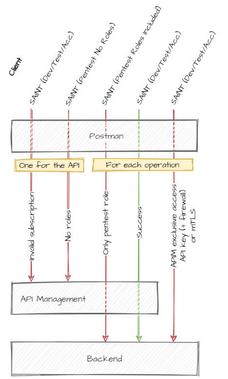

## MUST include pen test for each operation [61]

The five scenario's you must test can be found in figure 1. The tests consists of four pentests and one succesfull tests. The tests that go to the backend must be included per API operation.

##


Figure 1: Five tests types to include in a Postman collection.

test 1: MUST include test with invalid subscription
test 2: MUST include test with none of the required roles
test 3: MUST include test with only pentest role for each operation
test 4: MUST include test case which succeed for each operation
test 5: MUST include test with invalid API key and/or certificate and/or IP whitelist for each operation

## MUST include test with invalid subscription [62]

```bash
curl --location --request GET 'https://api.dev.stedin.net/users/v2?requesterId=12345' \
--header 'Apim-Subscription-Key: 12345' \
--header 'Authorization: Bearer ***'
```

The subscription key used for this request should be invalid. The token used for this request should be valid.
API management returns a 401 when the subscription key is incorrect.

## MUST include test with none of the required roles [63]

```bash
curl --location --request GET 'https://api.dev.stedin.net/users/v2?requesterId=12345' \
--header 'Apim-Subscription-Key: ***' \
--header 'Authorization: Bearer ***no roles'
```

The subscription key should be valid and the token should not contain any of the required roles. Any of the required roles are all the roles defined in the policies. The following policy in API management checks if one of the required roles is included in the token.

```xml
<validate-jwt header-name="Authorization" failed-validation-httpcode="401" failed-validation-error-message="Unauthorized. Access token is missing or invalid." require-expiration-time="true" require-scheme="Bearer" require-signed-tokens="true" output-token-variable-name="jwt">
    <openid-config url="{{stedin-net-open-id-config-url}}"/>
    <audiences>
        <audience>{{clientid-users}}</audience>
    </audiences>
    <required-claims>
        <claim name="roles" match="any" separator=",">
            <value>Users.Read.All</value>
            <value>Users.Delete.All</value>
            <value>Users.Write.All</value>
            <value>Userservice.Pentest</value>
        </claim>
    </required-claims>
</validate-jwt>
```

API management returns a 401 response if none of the required roles is included in the token.

## MUST include test with only pentest role for each operation [64]

```bash
curl --location --request GET 'https://api.dev.stedin.net/users/v2?requesterId=12345' \
--header 'Apim-Subscription-Key: ***' \
--header 'Authorization: Bearer ***users.pentest.all'
```

The subscription key should be valid and the token should not contain the correct role. As you can see in the policy shown under test 2 the extra role `Userservice.Pentest` is included. Every App registration should have a similar extra role for pentest usage. The naming convention for the pentest role is: '{AppRegistrationName}.Pentest'. The app registration 'SAINT ( {Environment} Pentest Roles Included)' should have API permissions on the pentest role.

API management will pass through the API as the token contains one of the roles. A server that receives valid credentials that are not adequate to gain access ought to respond with the 403 (Forbidden) status code. Therefore the backand should retun a 403 if the correct role is not included in the token.

## MUST include test case which succeed for each operation [65]

```bash
curl --location --request GET 'https://api.dev.stedin.net/users/v2?requesterId=12345' \
--header 'Apim-Subscription-Key: ***' \
--header 'Authorization: Bearer ***'
```

The subscription key and the token should be valid.
API managment will pass through the API as the token contains one of the required roles. The backend should validate the token and return a 2**
If the operation changes state in the backend may also test for a "Bad request" 400 response.

## MUST include test with invalid API key and/or certificate and/or IP whitelist for each operation [66]

```bash
curl --location --request GET 'https://backendurl/v2/search-users?requesterId=12345' \
--header 'functions-key: ***invalid' \
--header 'Authorization: Bearer ***'
```

The backend url is called directly with a correct token and a incorrect API key and/or certificate and/or IP whitelist, dependents on the authentication used in the backend. In this example a function key is used besides the token. Therefore a incorrect function key is used to test if the backend returns a 401.

403 as response code is allowed if the backend cannot provide a 401. In this blog you can find more information about the similarities and difference between 'forbidden' and 'unauthorized': [Forbidden, Unauthorized, or What Else?](https://auth0.com/blog/forbidden-unauthorized-http-status-codes/)
